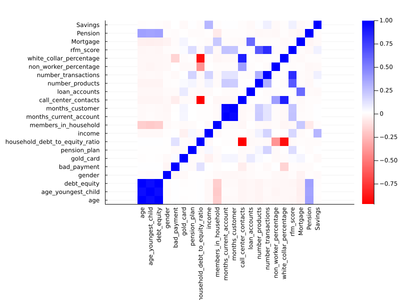
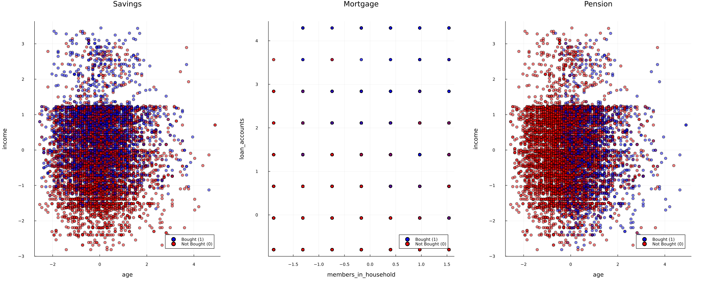
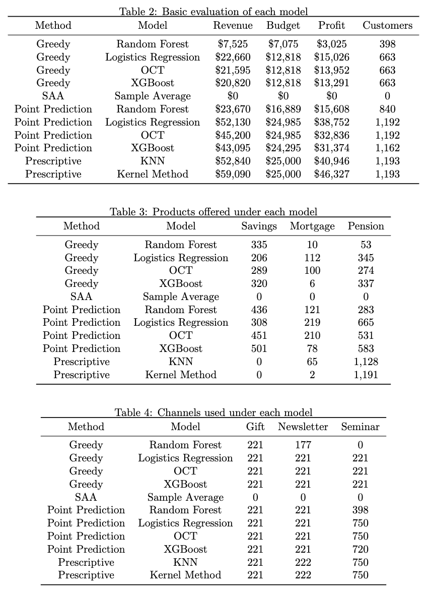
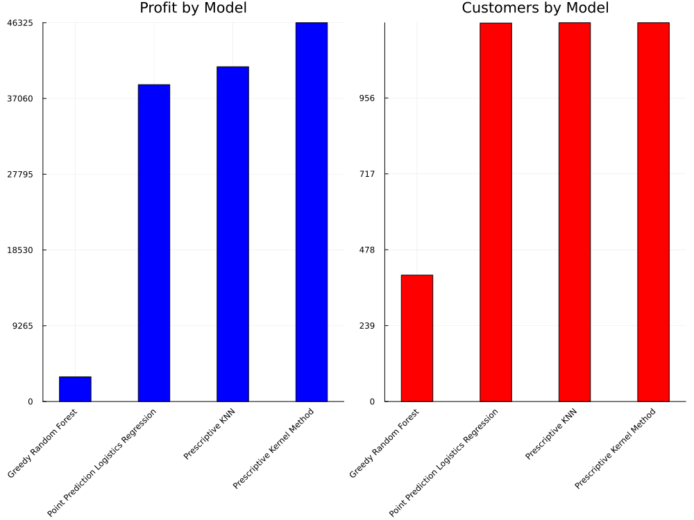
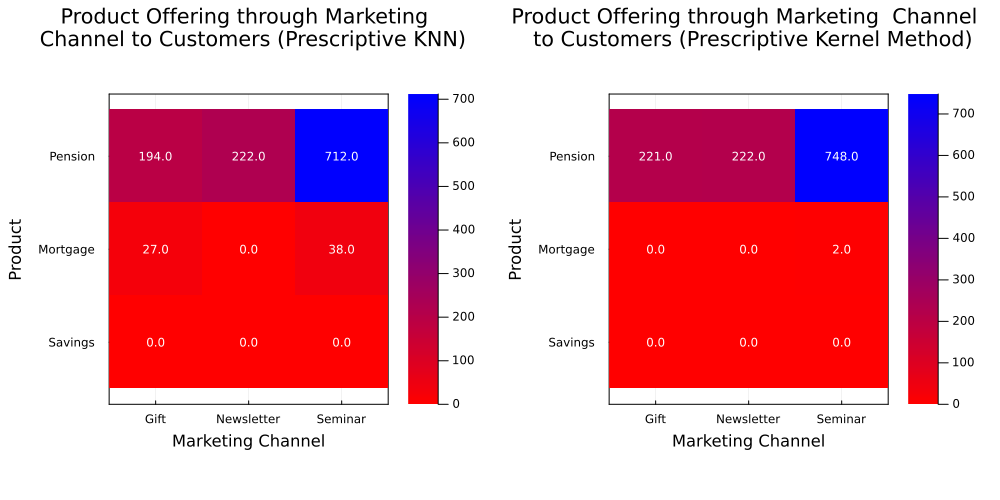

# Promoting Financial Products to Bank Customers: From a Prescriptive Analytics Perspective

Final Project - 15.095 Machine Learning Under a Modern Optimization Lens @MIT

Project Member: [Zeki Yan](https://www.linkedin.com/in/zikaiyan/), [Luca-Andrei Manea](https://www.linkedin.com/in/lucaandreimanea/)

## Table of Contents

- [Introduction](#Introduction)
- [Problem Statement](#Problem-Statement)
- [Dataset](#Dataset)
- [Methodology](#Methodology)
- [Feature Engineering](#Feature-Engineering)
- [Results and Analysis](#results-and-analysis)
- [Business Impact](#business-impact)

## Introduction

In the competitive financial services sector, banks must optimize marketing strategies to allocate resources and maximize profits efficiently. Rather than merely selling all products or predicting customer purchases, the goal is to craft a model that assigns the most lucrative marketing approach to potential customers based on their buying tendencies.

Our project delves into a retail bank's 2016 transaction data for three products: savings, mortgage, and pension accounts. Following a 2017 merger, the bank aims to deploy tailored marketing campaigns to new customers to maximize profitability.

## Problem Statement

The problem consists of two stages. We need to predict customer interest regarding the offered products and then make marketing Decisions based on them. The detailed demonstration is as follows:

1.  **Customer interest prediction**: In this stage, models need to be built to predict whether (or how much) each customer will be interested in each product the bank provides. The products are types of bank accounts that customers can open: Savings, Mortgage, and *Pension accounts*.
    
2.  **Marketing decision making**: The second stage consists of making marketing decisions based on the prediction result: deciding which product the bank should promote (or offer) to customers through which marketing channel. The channels are typical ways to bring advertisements to customers. These include *gifts* in promotional offerings, email newsletters, and financial literacy seminars to engage and educate customers.

The main decisions to be made are as follows:

1.  **To which customers should we promote our products?**

2.  **Which product should be proposed to each customer?**

3.  **Through which channel should we promote the product to the customer?**

To solve the problem, we used the customers' historical data before the merger, where customer behavior and additional demographic data were recorded. This was used to build models and make decisions. Finally, the models' performances were evaluated, and the highest expected profit-achieving model was selected to make final decisions for future marketing decisions.

## Dataset

Two datasets were used for this project. The known customer dataset contains basic customer information and customer behavior, which is their account opening history for different bank products. At the same time, the unknown data only has basic customer information of the newly acquired customers. The source of these two datasets are the following:

1.  **[Old Customers Dataset](https://raw.githubusercontent.com/vberaudi/utwt/master/known_behaviors.cs)**:
    This dataset includes all the customers in 2016, with their financial data and whether they bought savings, mortgage, and pension accounts.
    
2.  **[Newly Acquired Customers Dataset](https://raw.githubusercontent.com/vberaudi/utwt/master/unknown_behaviors.csv)**:
    This dataset includes the new customers in 2017 after the merger with the same variables except for which accounts they bought.

## Methodology

Our project used both predictive and prescriptive approaches that given the observational data (customer personal and financial data), output the product to be sold to a customer (interest) that results in the the highest profit based on the marketing campaign (decision). The following four methods are implemented independently to make decisions:

1.  **Greedy Algorithm**: Served as baseline model. The algorithm goes through all the customers, products, and channels, making assignments to those demands (in terms of product interest) that are not satisfied yet and ends once no more offers can be made.
    
2.  **Sample Average Approximation**: Utilizes only training set data to make decisions. This method accounts for uncertainty but not for auxiliary data.
    
3.  **Point Prediction**: Making predictions of customer's interests utilizing the training set data, then making decisions for customers in the test set using the information we have about them. This method accounts for auxiliary data but not for uncertainty.
    
4.  **Predictive Prescription**: Making predictions and decisions all at once. This method accounts for both auxiliary data and uncertainty.

We also chose corresponding machine learning models for each method to make predictions. The models that we have used include the following:

1.  **Random Forest**: Combines the output of multiple decision trees to reach a single result. It can be used for the Greedy Algorithm, Point Prediction and Predictive Prescription method.
    
2.  **Optimal Classification Tree**: A classification tree that can be conducted and solved using optimization methods to gain the best structure. It can be used for the Greedy Algorithm and Point Prediction method.
    
3.  **Logistics Regression**: Performs classification. It can be used for the Greedy Algorithm and Point Prediction method.
    
4.  **K-Nearest Neighbor**: Find K nearest neighbors in the known dataset of the new incoming data points. It can be used for the Greedy Algorithm, Point Prediction, and Predictive Prescription Method.
    
5.  **Kernel Methods**: Local Kernel Methods, similar to *k*-NN; another way to assign weights, which also accounts for uncertainty. It can be used for the Greedy Algorithm, Point Prediction, and Predictive Prescription method.

We test the performance of all the methods and models based on the test set data we split from the **[Newly Acquired Customers Dataset](https://raw.githubusercontent.com/vberaudi/utwt/master/known_behaviors.csv)** and calculate metrics based on the old customers' behaviors to assess model performance. These metrics include *revenue*, *budget used*, *profit*, *number of customers served*, *how many times each product is offered*, and *how many times each marketing channel is used*.

## Feature Engineering

As the first step of feature engineering, we calculated the correlation of all the columns to get a better understanding of the data.

The highest correlated feature for savings accounts is ***income***, with a correlation of around 0.2987. This makes sense as one would generally assume that people with higher incomes have more money to save and are, therefore, more likely to have saving accounts. For pension accounts, the highest correlated features are ***age***, ***age_youngest_child***, and ***debt_equity***, at a correlation of approximately 0.3814. This is because the three features have a perfect positive correlation. This is surprising since the dataset contains 8,818 different customers. Of these three features, age seems to be the most relevant because it is more general and easier to source. The highest correlated feature for mortgage accounts is ***loan accounts***, with a correlation of about 0.5916. ***Members_in_household*** also describes a part of the Mortgage target variable. Even though the correlation is only around 0.2278, it might help to include it.

These four features are the most important in explaining the three target variables, whereas the other features do not add much information. We, therefore, restrict the dataset only to contain the following features: ***age***, ***income***, ***members_in_household***, and ***loan_accounts***.

The scatter plot visualizes the relationship for each product of their most correlated features. From the scatter plots, it becomes visible that the features that have been chosen are indeed important in understanding whether or not a customer bought a product. It indicates that customers with higher incomes tend to have savings accounts more than customers with lower incomes. For pension accounts, the focus lies on the age column. The dataset has more older customers than younger customers with pension accounts. Higher numbers of loan accounts and members in the household tend to jointly lead to a higher likelihood of owning mortgage accounts.

## Results and Analysis

For the four methods, the ranking (based on profit) of the models' performances is as follows:

-   *Prescriptive* $>$ *Point Prediction* $>$ *Greedy* $>$ *Sample Average Approximation*

Note that the Sample Average Method generates empty results because it is infeasible in this case since the same decision is prescribed to all customers, which is not feasible under the budget constraint.

For the different prediction models, the ranking (based on profit) is as follows:

-   Kernel Method $>$ *k*-NN $>$ Logistics Regression $>$ OCT $>$ XGBoost $>$ Random Forest

Regarding the ability to utilize the budget and serve customers, out of all the methods we applied, only prescriptive methods utilized the entire budget ($25K) to promote products. Point Prediction used nearly all of the budget, and the Greedy Method used the least. One reason is that compared to the prescriptive method, the other methods do not consider either the information in the auxiliary variables or the uncertainty of decision-making, which results in imperfect solutions when applying these methods. The second reason is that compared to the k-NN and Kernel Methods; other prediction models are not good at predicting the interest variables. In most cases, they predicted less customer interest than was apparent in the test set. Because of this, the optimization model cannot allocate all of the budget, as there would be no gain.

As for the distribution of products that these methods offer, the "smarter\" prescriptive methods tend to assign the most profitable products: the Pension accounts first, then the Mortgage account, and finally, the *Savings account*. The same thing is done for the marketing channels, ensuring that all the channels serve at least 10% of customers and then making all the remaining product promotions through the *Seminar channel*.

## Business Impact

Our method notably improves the expected profit of the bank. Previously, the bank used the Greedy method to make marketing decisions. For the subset of customers (20% of total customers) we chose, the Greedy method generates profits of **\$11,323** (the average of all the corresponding models). In contrast, our best model (Prescriptive method powered by the Kernel Method) can generate a profit of **\$46,327**, which signifies an increase of **309%**. If the bank implemented our method entirely, it could generate estimated profits of **\$175K** for all 11K customers.
